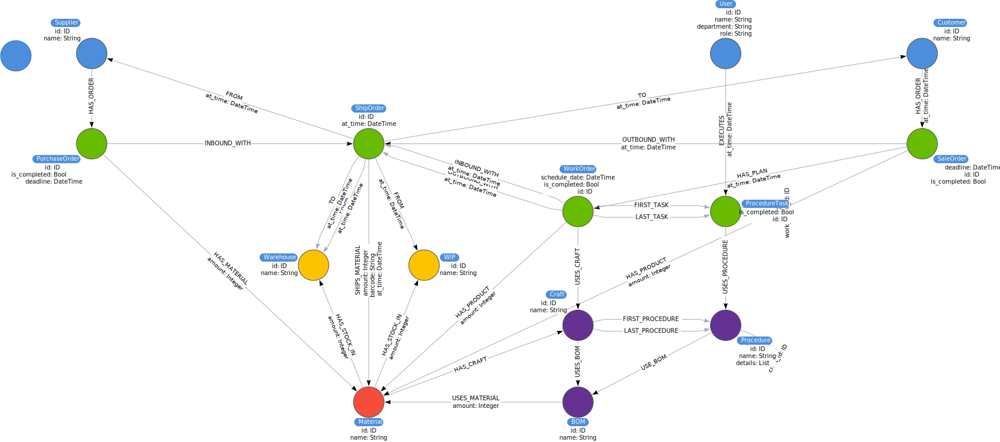
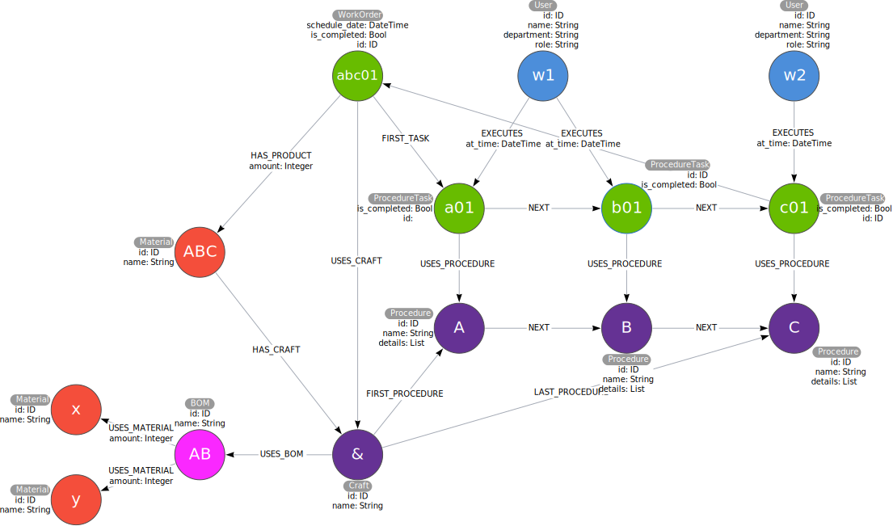

# Introduction

Here we are trying to develop a Manufacturing Executive System with GRANDstack architect.

# Setup Environment

1. Create a new neo4j database on [neo4j sandbox](https://sandbox.neo4j.com/). Copy the _Bolt URL_, _Username_ and _Password_ from the _Connection Details_ tag.
2. Create a new GRANDstack application with the starter.

   ```bash
   npx create-grandstack-app graph-mes
   ```

# Domain Modeling

## Step 1: Understanding the domain

Identify the **stakeholders** and the **users** of the application (people, systems). Enumerate the **use cases** that are agreed upon by all stakeholders where users are part of the use case.

**Stakeholders:**

- Factory Owner
- Production Director / Manager

**Users & Systems:**

- Manager
- Worker
- ERP
- WMS

**Use Cases:**

Suppose we are going to open a factory, we should first have a **product** to sell and the **craft** that tell us how to make it. We also need a list of raw **material** we need which called **Bill Of Materials**. Then we can sell our product to the market and get some **orders** which require certain amount of our product.

So here are some basic use cases we can list for our MES:

- User creates/edits products and other materials.
- System lists all the products and materials that is created.
- User creates/edits a craft of a product with several procedures.
- User creates/edits a BOM of a product.
- System lists the craft and BOM of a product.
- User adds details to a procedure of a craft.
- User creates/edits a sale order of a group of products.
- System lists all the sale orders.
- User creates/edits a work order of a group of products.
- User splits/merges orders to create a work order with specific deadline and certain amount of products.
- User assigns the work order to a role.
- System lists all the work orders.
- User execute a procedure of a work order.
- User draws materials according to BOM from warehouse/WIP.
- User completes certain amount of (intermediate) product with after scanning a barcode.
- System shows the procedures of current work order.
- User adds a material to warehouse.
- User sends the rest materials back to warehouse.
- User sends the completed products to warehouse.
- System lists the inventory of all materials.
- System lists the workload of every workers.
- User ships some stocks of several from one place to another.

## Step 2 : Create a initial schema

Create our first model with the awesome visual model editor: [Arrows](https://arrows.app/)



## Step 3: Create high-level sample data to gain an intuitive view

A brief description of data.

- 1 product
- Simple craft with 3 procedures to be executed one after another
- BOM has 2 raw materials which are needed on the first procedure
- 2 worker of the 1st procedure, worker of the 2nd procedure

## Step 3: Ask specific questions for this domain

Questions for our MES:

- What is the available inventory of a certain material?
- How many products need to produce for a sale order?
- What is the BOM of a product?
- How to make a certain product?
- Which sale order is going to over due?
- How many orders are required to be completed before a certain date?
- For a certain sale order, how many products have been made/are making/haven't been made?

## Step 5: Test questions with sample data and refactor



## Step 6: Test scalability and refactor

Discuss with domain experts about the magnitude of each entities. Consider what will the model be like with that amount of data and the efficiency to query in that model. Especially try to avoid super node, which is node with huge amount of relations.

# Play with Neo4j and Cypher

Now we need to write some Cypher queries to answer the questions above. You may find that new questions come out when you are writing queries. That's totally fine. The understanding of domain will change in the iteration of asking questions and answering with new model, so we may need to refactor our model constantly. We can refactor our model very quickly with Neo4j, so keep feel free to update our question list to make our model fit with the real scenario.

## Function List

Here we jump through those questions as we are experienced MES developers (LOL), and let's focus on some essential functions we have develop in our product before.

- All
  - Create a product or material
  - List all the materials
  - Create a craft with several procedures
  - Link a craft to a product
  - Create a BOM consist of materials with certain amount
  - List all the BOMs
  - Link a BOM to a craft
  - Link a BOM to a procedure
  - List the craft of a product
  - List the BOM of a product
  - Create an order of a product with certain amount and deadline
  - Select an available craft and BOM for this order
  - Auto-create the procedures tasks of an order according to the craft
  - List all the orders
  - List the amount of raw materials needed for production
  - List the procedure tasks of an order
  - ~~Show the progress of an order~~
  - Show the current tasks of an order
  - Show the completed amount of production with required
- Worker
  - List all the tasks that need to be completed
  - Execute a task

## Initialize the database with sample data

We need to add some data to our database at first. With [Arrows](https://arrows.app/), we can easily export our sample data from model to Neo4j database simply click **Download/Export** button on the upper right corner, and choose export type **Cypher**. We can choose **CREATE** to import data in the first time, and we can export with **MERGE** when we update our model.

Then in the Neo4j browser, we can check the schema and all the data imported with:

```Cypher
CALL db.schema.visualization()
```

```Cypher
MATCH (n) RETURN n
```

## Initialize GraphQL server with existing database

Before we get our hands dirty with data, let's start the GraphQL server first. And you will be surprised how much time could be saved with GraphQL.

Let's generate GraphQL definitions from our existing database with one line.

```bash
npm run inferschema:write
```

Now we can see the `/api/src/schema.graphql` has been regenerated with all the GraphQL type definitions we need.

Let's try send our first request with GraphQL Playground.

```bash
npm run start
```

Now we can visit with GraphQL Playground on <http://localhost:4001/graphql>

## Add constraints to the database

We need to create uniqueness constraint to prevent our data turn into chaos after mutations. Also we want to speed up queries by setting index. We can add all these constraints with Cypher language in Neo4j browser, though it will take sometime if we want to add lots of constraints to the database. Luckily, we can take advantage of built-in function in `neo4j-graphql.js` to active generate and update constraints to database.

Let's set it up.

```/api/src/index.js
const schema = makeAugmentedSchema({
  typeDefs,
  config: {
    experimental: true,

const driver = neo4j.driver(...)

assertSchema({ schema, driver, debug: true })
```

Now we can use `@id`, `@unique`, `@index` after the properties of a node or relation.

## First request with generated API

## More complex logics

- BOM
  - Create a BOM with unique ID
  - Connect this BOM to material with certain amount

```cypher
// bomDetail = [{ name: "leg", amount: 4 }, { name: "board", amount: 1 }]

// Create a BOM
UNWIND $bomDetail AS detail
MATCH (product:Material{name: $productName})
MATCH (material:Material {name: detail.name})
MERGE (bom:BOM {name: $BOMName})
  ON CREATE SET bom.id = apoc.create.uuid()

// Connect this BOM to material with certain amount
MERGE (product)-[:HAS_BOM]->(bom)
MERGE (bom)-[:USES_MATERIAL {amount: detail.amount}]->(material)

RETURN bom
```

- Craft
  - Create a craft with unique ID
  - Add procedures to craft with order

```cypher
// craftDetail: [{ name: "p0", next: "p1"}, { name: "p1", next: "p2"}, { name: "p2"}]

/// Create a craft.
MATCH (product:Material{name: $productName})
MERGE (craft:Craft {name: $craftName})
  ON CREATE SET craft.id = apoc.create.uuid()
MERGE (product)-[:HAS_CRAFT]->(craft)
WITH craft

// Add procedures to craft with order.
MATCH (first:Procedure {name: $craftDetail[0].name})
MATCH (last:Procedure {name: $craftDetail[-1].name})
MERGE (craft)-[:HAS_PROCEDURE {is_first: true}]->(first)
MERGE (craft)-[:HAS_PROCEDURE {is_last: true}]->(last)
WITH craft

UNWIND $craftDetail AS detail
MATCH (procedure:Procedure {name: detail.name})
WHERE detail.next IS NOT NULL
MATCH (next:Procedure {name: detail.next})
MERGE (procedure)-[:NEXT {craft: craft.name}]->(next)
MERGE (craft)-[:HAS_PROCEDURE]->(procedure)

// TODO: return null when given one procedure.
RETURN craft
```

- WorkOrder
  - Create an order with unique ID
  - Create tasks from craft
  - Add order to tasks

```cypher
// Create an order.
MATCH (product:Material{name: $productName})
MERGE (order:WorkOrder {id: apoc.create.uuid()})
  ON CREATE SET order.is_completed = false, order.deadline = $deadline
MERGE (product)<-[:HAS_PRODUCT {amount: $productAmount}]-(order)
WITH order

// Create tasks from craft.
MATCH (craft:Craft {name: $craftName})-[:HAS_PROCEDURE]->(procedure:Procedure)
MERGE (order)-[:USES_CRAFT]->(craft)
MERGE (procedure)<-[:USES_PROCEDURE]-(task:ProcedureTask {id: apoc.create.uuid()})
  ON CREATE SET task.name = procedure.name, task.is_completed = false, task.amount = $productAmount
MERGE (order)-[:HAS_TASK]->(task)
WITH order, task, craft

// Add first and last mark.
MATCH (craft)-[:HAS_PROCEDURE {is_first: true}]->(:Procedure)<-[:USES_PROCEDURE]-(first:ProcedureTask)<-[:HAS_TASK]-(order)
MATCH (craft)-[:HAS_PROCEDURE {is_last: true}]->(:Procedure)<-[:USES_PROCEDURE]-(last:ProcedureTask)<-[:HAS_TASK]-(order)
MERGE (order)-[ft:HAS_TASK]->(first)
SET ft.is_first = true
MERGE (order)-[lt:HAS_TASK]->(last)
SET lt.is_last = true
WITH order, task

// Add order to tasks.
MATCH (task)-[:USES_PROCEDURE]->(:Procedure)-[:NEXT]->(:Procedure)<-[:USES_PROCEDURE]-(nextTask:ProcedureTask)<-[:HAS_TASK]-(order)
MERGE (task)-[:NEXT]->(nextTask)

RETURN order
```

- Execute a task
  - Execute a task
  - Complete a task if the required amount is finished
  - Complete an order if the last task is completed

```cypher
// Execute a task.
MATCH (user: User {name: $userName})
OPTIONAL MATCH (task: ProcedureTask {id: $taskId, is_completed: false})
MERGE (user)-[:EXECUTES {at_time: $time, amount: $amount}]->(task)
WITH task

// Complete a task if the required amount is finished.
MATCH (task)<-[exe:EXECUTES]-(:User)
WITH task, sum(exe.amount) AS completedAmount
WHERE completedAmount >= task.amount
SET task.is_completed = true
WITH task

// Complete an order if the last task is completed.
MATCH (task)<-[h:HAS_TASK]-(order:WorkOrder)
WHERE NOT (task)-[:NEXT]->() AND task.is_completed = true
SET order.is_completed = true
RETURN true
```

**Tips:**

- Better use Cypher rather than APOC.
- Combine Cypher quires with JavaScript if when handling complex logic.

# Build up frontend With React and Material UI

## Have a quick look on Material UI.

[Material UI](https://material-ui.com/)

## Components we need to use.

As we have a quite simple data structure, we can design a template rather than build frontend page one by one. Here is a design that fit our MES well.


- [x] Drawer
- [ ] App bar (with search function)
- [ ] Data table that can collapse and expand
- [x] Popup (Dialog) that can have be used to add, update or delete items
- [x] Button in each row
- [x] Button above the table

# Authentication and authorization with JWT

@hasRole, @hasScope, @isAuthenticated

# Explore

- [ ] auto generation
- [ ] clone graph
- [x] APOC: conditional expression
- [ ] APOC: automatic
- [ ] use JS with cypher
- [ ] complex logics in cypher
- [ ] [Custom Resolvers](https://grandstack.io/docs/graphql-custom-logic#implementing-custom-resolvers)
- [ ] How to deal with date time in neo4j
- [ ] Neo4j cli
- [ ] How edit cypher in vscode
- [ ] graphql extension config in package.json
- [ ] Typescript and code generator

# Bugs and requirements

- [ ] Craft can not accept one procedure
- [ ] Update BOM, craft, order
- [ ] Control outputs in a complex process
- [ ] Do not display Delete button when create an item
- [ ] Move create button into toolbar
- [ ] Missing "key" prop for element in iterator
- [ ] Use table head to select certain columns of data
- [ ] Use dictionary to rename table head
